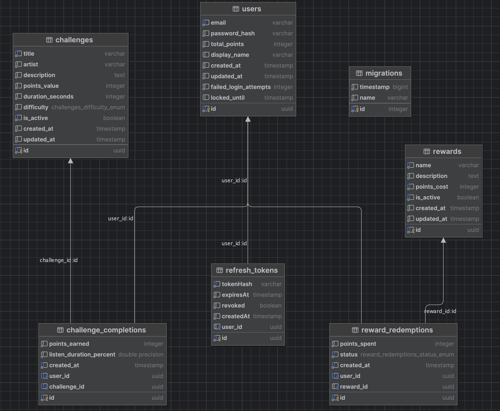

# Database & Infrastructure Architecture

This document maps out our data engine, entity configurations, background streams, and job definitions.

---

## Database Relationships

### Main Entities

#### User
Represents a registered platform user.
- **Relationships:**
  - One-to-many → `ChallengeCompletion`
  - One-to-many → `RewardRedemption`
  - One-to-many → `RefreshToken`

#### Challenge
Represents a custom listening metric challenge.
- **Relationships:**
  - One-to-many → `ChallengeCompletion`

#### Reward
Represents an item or reward open to user redemption points.
- **Relationships:**
  - One-to-many → `RewardRedemption`

#### ChallengeCompletion
Tracks completed challenges mapped back to unique users.
- **Relationships:**
  - Many-to-one → `User`
  - Many-to-one → `Challenge`

#### RewardRedemption
Tracks the real-time fulfillment history of specific rewards.
- **Relationships:**
  - Many-to-one → `User`
  - Many-to-one → `Reward`

#### RefreshToken
Stores unique, hashed user refresh tokens to sustain auth lifecycles securely.
- **Relationships:**
  - Many-to-one → `User`

---

## Entity Relationship Diagram

---

## Redis Usage

Redis acts as our lightning-fast in-memory layer utilized explicitly for:
- Global and transactional rate limiting
- Leaderboard ranking caching
- Low-latency query lookups for high-frequency user positions

---

## RabbitMQ Usage

RabbitMQ workers spin up natively alongside the app bootstrap cycle to execute heavy compute off the HTTP event thread.

### Active Event Consumers:

**Note**: Both consumers are currently only logging the events. They could be extended to prepare the leaderboard in the background which can work better than a background job.

- **Challenge consumer:** Validates and awards challenge logs.
- **Reward consumer:** Processes inventory locks and tracking receipts asynchronously.

---

## Scheduled Jobs

### Leaderboard Rebuild Job

**Note**: Current leaderboard is read from redis cache. An improvement is to back it with a database in case Redis goes down.

- **Cron Pattern:** `*/30 * * * * *`
- **Behavior:** Re-compiles user tiers and flushes cached layers every 30 seconds.

---

## Example Request Flow

1. User registers via API.
2. JWT access + refresh token is safely generated.
3. User completes a challenge event.
4. Points are aggregated and credited to the user's account entity.
5. An event tracking payload is fired off asynchronously to RabbitMQ.
6. The background consumer updates the Redis cache state for global ranking tiers.
7. User queries rankings and immediately redeems rewards with their fresh points balance.
